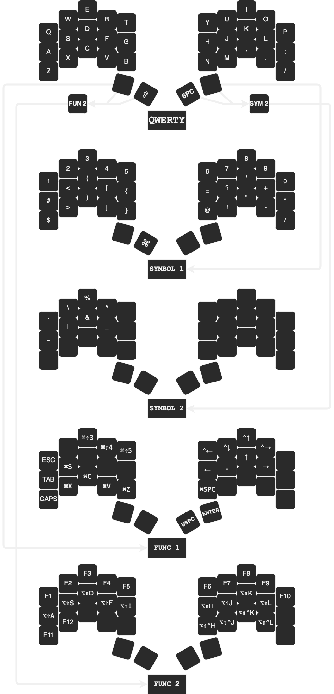

# ferris/sweep QMK keymap

This is for sweep none-bluetooth version.

I'm using macOS, with [Amethyst WM](https://github.com/ianyh/Amethyst), so I added Amethyst shortcuts.

Inspired by [duckyb's keymap](https://github.com/duckyb/zmk-sweep).



## quick start

Clone and move this repo to the qmk ferris folder, mine in <code>~/qmk_firmware/keyboards/ferri/keymaps/</code>.

Rename the folder to whatever you want, for me it's <code>weevil</code>.

Then compile:

```
qmk compile -kb ferris/sweep -km weevil
```

## reference

* [QMK: Macro buttons](https://getreuer.info/posts/keyboards/macros/index.html)
* [QMK: Layer Lock key](https://getreuer.info/posts/keyboards/layer-lock/index.html)
* [qmk doc: combo](https://github.com/qmk/qmk_firmware/blob/master/docs/feature_combo.md)

## modify

Keymaps are pretty personal, due to the language you use and preference. So you can change it to suit yourself.

You can edit the [diagram file](./weevil.diawio) on [diagrams.net](https://www.diagrams.net/).

